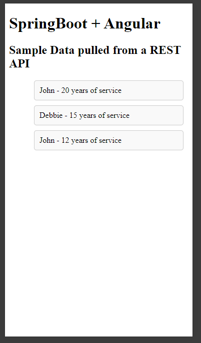

Learning-In-Progress

I had a pre-interview assignment which involves Spring, which at the time of the request, I know nothing about Spring and didn't have a lot of free time at that moment to learn it.

I'm going to be doing that assignment on this repo and document as I learn. 

 Here is the assignment:
 Database: Employee tables 
 | ID | First_Name | Last_Name | Years_of_Service | 
 |--|--|--|--| 
 | 1 | John | Doe|	20|
 |2|Debbie|Williams|15| 
 |3|Joe|Jones|9| 
 |4|Helen|Chan|5|
 |5|John|Smith|12|
> 
> Above is a database table containing employees. Please write code to
> retrieve employees who have been in service for more than 10 years.
> Your restful service will be consumed through the following URL
> http://localhost/coding/test/employees
> 
> Task 1:  Use Java8+ and (spring boot or J2EE) to write restful service
> to retrieve employees. 
> 
> Task 2: Use Angular framework to consumes what is created in step1 and
> display the result in html table.
> 
> Task 3: Create restful service to update employee record.
> 
> Task 4: Display dialog box to edit employee record when ID is clicked
> from (TASK2). Enter new Years_of_service value and click edit/submit
> button. Use restful service created in Task3 to update the record.
> Display the updated list once update is successful.

**May 22, 2024**

Managed to load locally using SpringBoot

**May 23, 2024**

Changed H2 db to MySQL db

**May 24, 2024**

Learned that I know nothing about Angular.
Will now sidetrack to learning Angular. 
Rabbithole here we go!

**June 2, 2024**

Started learning Angular at 2AM, https://github.com/Dotsz-Vic-FLP/TestAngular

**June 16, 2024**

Did a pivot on the angular tutorial into consuming the SpringBoot API, and it worked!
